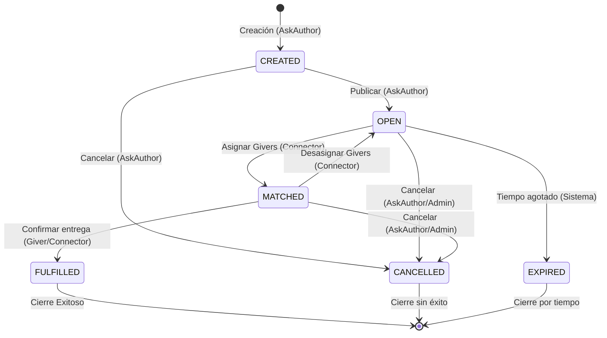

# Flujo de Estados de una Petición (Ask) en AskingX

Este documento describe el ciclo de vida completo de una petición de ayuda dentro del sistema AskingX.

## Diagrama de Flujo (Mermaid)

## Descripción de los Estados

1. **CREATED (Creada):**
   - **Descripción:** Estado inicial al crear la petición. Es un borrador que solo ve el creador (AskAuthor) y los administradores.
   - **Acción requerida:** El AskAuthor debe revisarla y pasarla a `OPEN` para que los Connectors puedan empezar a buscar voluntarios.

2. **OPEN (Abierta):**
   - **Descripción:** La petición es visible para los Connectors dentro de su "bolsa de trabajo" según su dominio de especialidad.
   - **Acción requerida:** Un Connector asume la petición y busca en la base de datos de Givers (voluntarios) disponibles para asignarlos.

3. **MATCHED (Asignada):**
   - **Descripción:** La petición ya tiene uno o varios voluntarios (Givers) asignados.
   - **Comportamiento Automático:** El sistema envía un correo electrónico notificando tanto a la organización solicitante como a los voluntarios asignados.
   - **Retroceso:** Si por algún motivo los voluntarios no pueden cumplir, el Connector puede desasignarlos, devolviendo la petición al estado `OPEN`.

4. **FULFILLED (Completada):**
   - **Descripción:** Estado final de éxito. La ayuda ha sido entregada a la organización o persona.
   - **Implicaciones:** La petición ya no se puede modificar. Queda en el histórico para métricas e Historias de Impacto.

5. **CANCELLED (Cancelada):**
   - **Descripción:** La petición ha sido anulada manualmente por el creador o un administrador antes de ser completada.

6. **EXPIRED (Caducada):**
   - **Descripción:** La fecha límite (`dueDate`) ha pasado sin que la petición se haya completado.
